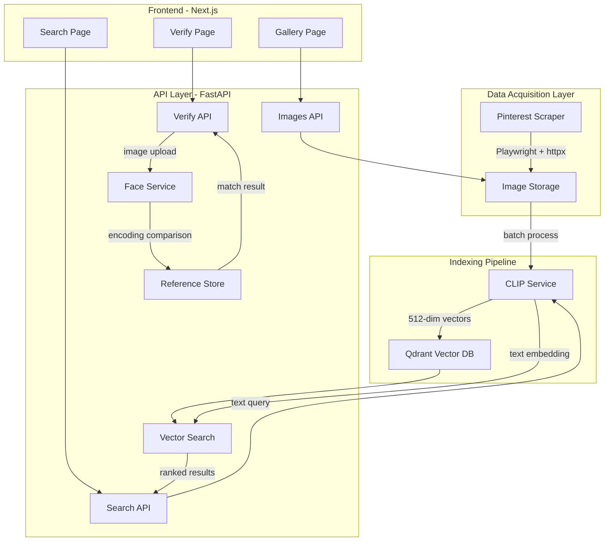
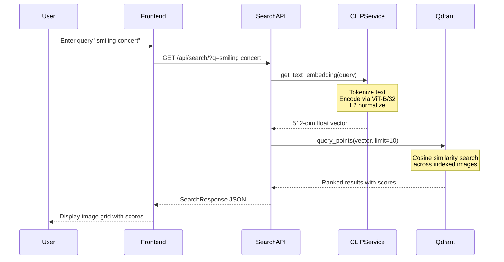
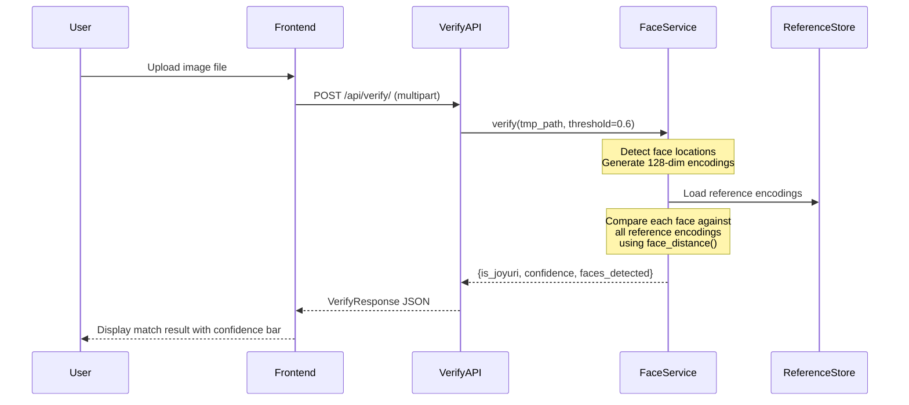

# Report
## Jo Yuri Image Recognition System

This document provides a deep technical analysis of the Jo Yuri Image Recognition System, translating the implementation into valuable career learning and future development opportunities.

---

## 1. Technical Architecture & Code Flow

### 1.1 System Overview

The system implements a **dual-AI pipeline** combining:
- **CLIP (Contrastive Language-Image Pretraining)** for semantic text-to-image search
- **dlib-based Face Recognition** for identity verification

This architecture demonstrates the modern paradigm of composing multiple specialized AI models to solve complex, multi-faceted problems.

### 1.2 High-Level Architecture Diagram



### 1.3 Detailed Data Flow

#### Semantic Search Flow



#### Face Verification Flow



### 1.4 Module Interaction Map

```
Entry Points
  |
  +-- main.py (FastAPI app initialization)
  |     |
  |     +-- api/routes/
  |           +-- search.py --> clip_service + vector_store
  |           +-- verify.py --> face_service
  |           +-- images.py --> clip_service + vector_store + file I/O
  |
  +-- scripts/
        +-- index_images.py --> clip_service + vector_store (batch)
        +-- scraper/pinterest.py --> Playwright + httpx (standalone)

Services (Singleton Pattern)
  |
  +-- clip_service (CLIPService)
  |     Lazy-loads PyTorch CLIP model
  |     Handles GPU/CPU device selection
  |
  +-- face_service (FaceService)
  |     Manages reference encoding lifecycle
  |     Persists encodings via pickle
  |
  +-- vector_store (VectorStore)
        Lazy-connects to Qdrant
        Auto-creates collection with correct schema
```

### 1.5 Key Entry Points

| Entry Point | Purpose | Trigger |
|-------------|---------|---------|
| `backend/app/main.py:1` | FastAPI app bootstrap | `uvicorn app.main:app` |
| `backend/scripts/index_images.py:44` | Batch indexing CLI | `python scripts/index_images.py` |
| `backend/scripts/scraper/pinterest.py:174` | Image scraper CLI | `python -m scripts.scraper.pinterest` |
| `frontend/src/app/page.tsx:7` | Search page component | Browser navigation to `/` |

---

## 2. AI Concepts & Implementation Analysis

### 2.1 AI/ML Patterns Identified

#### Pattern 1: Embedding-Based Semantic Search (Vector Search)

**Location:** `clip_service.py:22-45`, `vector_store.py:47-62`

**What it does:**
- Converts both images and text into a shared 512-dimensional embedding space
- Uses cosine similarity to find semantically related content across modalities

**Why this pattern:**
- CLIP was trained on 400M image-text pairs, learning rich cross-modal representations
- The shared embedding space enables "zero-shot" search without labeled training data
- Cosine similarity is efficient and naturally handles normalized vectors

**Implementation highlights:**
```python
# L2 normalization for cosine similarity (clip_service.py:31-32)
embedding = embedding / embedding.norm(dim=-1, keepdim=True)

# Qdrant uses COSINE distance metric (vector_store.py:29)
distance=Distance.COSINE
```

#### Pattern 2: Biometric Face Verification (1:N Matching)

**Location:** `face_service.py:57-100`

**What it does:**
- Generates 128-dimensional face encodings using dlib's pre-trained CNN
- Compares against a gallery of reference encodings
- Uses Euclidean distance with configurable threshold

**Why this pattern:**
- Face recognition is a solved problem with pre-trained models
- The 128-dim encoding is highly discriminative for identity
- Threshold-based matching allows tuning precision/recall tradeoff

**Implementation highlights:**
```python
# Distance-to-confidence conversion (face_service.py:87)
confidence = 1 - min_distance

# Configurable threshold for matching (face_service.py:92)
if min_distance <= threshold:
    is_joyuri = True
```

#### Pattern 3: Lazy Model Loading (Resource Optimization)

**Location:** `clip_service.py:14-19`

**What it does:**
- Defers model loading until first use
- Detects CUDA availability at runtime
- Keeps model in evaluation mode

**Why this pattern:**
- Large models (CLIP ViT-B/32 ~350MB) shouldn't load on import
- Enables fast API startup and healthchecks
- Singleton pattern ensures model is loaded only once

**Implementation highlights:**
```python
def _load_model(self):
    if self._model is None:  # Guard clause
        self._device = "cuda" if torch.cuda.is_available() else "cpu"
        self._model, self._preprocess = clip.load(...)
        self._model.eval()  # Disable dropout, BatchNorm updates
```

### 2.2 Prompt Engineering & Data Processing

#### Web Scraping Pipeline

**Location:** `scripts/scraper/pinterest.py`

**Techniques demonstrated:**
- **Progressive crawling**: Infinite scroll handling with `page.evaluate("window.scrollBy(0, 1000)")`
- **URL resolution**: Thumbnail to high-res conversion via pattern matching
- **Graceful degradation**: Fallback to lower resolution on 403 errors
- **Deduplication**: URL-based seen set to avoid re-downloading
- **Content validation**: Minimum file size filter to skip thumbnails

```python
# Resolution upgrade pattern (pinterest.py:96-101)
def _get_high_res_url(self, url: str) -> str:
    for size in ["/236x/", "/474x/", "/736x/"]:
        if size in url:
            return url.replace(size, "/originals/")
    return url
```

#### Batch Indexing Pipeline

**Location:** `scripts/index_images.py`

**Techniques demonstrated:**
- **Glob-based discovery**: Finding images by extension pattern
- **Progress tracking**: Console output with current/total counts
- **Error isolation**: Try/except per image to continue on failures
- **UUID generation**: Unique identifiers for vector database entries

### 2.3 Model & Library Choices

| Component | Choice | Rationale |
|-----------|--------|-----------|
| Embedding Model | CLIP ViT-B/32 | Best balance of speed/quality; 512-dim is compact |
| Vector Database | Qdrant | Purpose-built for similarity search; easy Docker deployment |
| Face Recognition | dlib via face_recognition | Battle-tested; no GPU required for inference |
| Web Framework | FastAPI | Async support; automatic OpenAPI docs; Pydantic validation |
| Scraping | Playwright | Handles dynamic JS; headless mode for servers |
| Frontend | Next.js 15 | React Server Components; App Router for modern patterns |

---

## 3. Career Value & Key Learnings

### 3.1 Resume-Ready Skills

**Core AI/ML Skills:**
- Vector embeddings and similarity search
- Multi-modal AI (text-to-image)
- Face recognition and biometric verification
- Model serving and inference optimization
- Feature extraction and dimensionality reduction

**MLOps & Infrastructure:**
- Vector database management (Qdrant)
- Docker containerization and compose orchestration
- GPU-aware model deployment (CUDA detection)
- Model caching and lazy loading patterns

**Backend Engineering:**
- FastAPI REST API design
- Pydantic data validation
- Async/await patterns
- File upload handling
- CORS configuration

**Frontend Engineering:**
- Next.js App Router
- React hooks (useState, useEffect, useCallback)
- TypeScript interfaces
- Tailwind CSS
- Drag-and-drop file handling

**Data Engineering:**
- Web scraping with Playwright
- Image processing pipelines
- Batch processing scripts
- Data deduplication

### 3.2 Technologies & Libraries Demonstrated

| Category | Technologies |
|----------|-------------|
| **AI Frameworks** | PyTorch, OpenAI CLIP, face_recognition (dlib) |
| **Vector DBs** | Qdrant |
| **Backend** | FastAPI, Pydantic, Uvicorn |
| **Frontend** | Next.js 15, React 19, TypeScript, Tailwind CSS |
| **Scraping** | Playwright, httpx |
| **Infrastructure** | Docker, Docker Compose |
| **Languages** | Python 3.11+, TypeScript 5 |

### 3.3 Engineering Principles Demonstrated

#### 1. Separation of Concerns
- Services are isolated (`clip_service`, `face_service`, `vector_store`)
- Each handles one responsibility
- Routes orchestrate but don't contain business logic

#### 2. Dependency Injection via Singletons
- Services instantiated once at module level
- Imported and used by routes
- Enables easy testing via mocking

#### 3. Configuration Management
- Pydantic `Settings` class with `.env` support
- Type-safe configuration
- Sensible defaults with override capability

#### 4. Graceful Error Handling
- Face detection returns structured responses, not exceptions
- Missing references return helpful messages
- Scraper handles 403s with fallback logic

#### 5. Type Safety
- Full Pydantic schemas for API contracts
- TypeScript interfaces mirroring backend types
- Generic type hints throughout Python code

---

## 4. Future Roadmap & Portfolio Extensions

### 4.1 Senior-Level Feature Additions

#### Feature 1: Real-Time Face Detection Stream

**Concept:** Add WebSocket endpoint for live camera feed face verification

**Implementation:**
- Add `websockets` dependency to FastAPI
- Create `/api/verify/stream` WebSocket endpoint
- Process frames in batches (every 5th frame)
- Return real-time verification results

**Why it demonstrates senior skills:**
- Shows understanding of real-time systems
- Demonstrates WebSocket protocol knowledge
- Requires performance optimization (batching, frame skipping)

#### Feature 2: Automated Model Evaluation Pipeline

**Concept:** Build a test harness to measure search and verification accuracy

**Implementation:**
- Create labeled test dataset (positive/negative Jo Yuri images)
- Implement precision/recall/F1 calculation
- Add `/api/eval/run` endpoint to trigger evaluation
- Store historical metrics in database

**Why it demonstrates senior skills:**
- Shows understanding of ML evaluation methodology
- Demonstrates data versioning awareness
- Proves ability to measure and improve models

#### Feature 3: Multi-Person Face Gallery

**Concept:** Extend system to recognize and search for multiple identities

**Implementation:**
- Add `identity` field to reference encodings
- Create admin UI for managing identity galleries
- Modify verification to return which person matched
- Enable search filtering by recognized identity

**Why it demonstrates senior skills:**
- Shows ability to generalize solutions
- Demonstrates database schema evolution skills
- Requires UX considerations for admin workflows

### 4.2 Architectural Improvements

#### Improvement 1: Async Processing with Task Queue

**Current limitation:** Image indexing blocks the request

**Proposed change:**
```
[Upload Request] --> [Celery Task Queue] --> [Background Worker]
       |                                            |
       v                                            v
   [Return job_id]                          [Index to Qdrant]
       |                                            |
       v                                            v
   [Poll /jobs/{id}]  <----  [Update job status]
```

**Benefits:**
- Non-blocking uploads
- Scalable to multiple workers
- Retry logic for failures
- Progress tracking

#### Improvement 2: Hybrid Search with Metadata Filtering

**Current limitation:** Pure vector search only

**Proposed change:**
- Add metadata to Qdrant payloads (date, source, tags)
- Implement filter parameters in search API
- Combine vector similarity with boolean filters

**Example query:**
```json
{
  "query": "smiling",
  "filters": {
    "source": "pinterest",
    "date_after": "2024-01-01"
  }
}
```

#### Improvement 3: Model Versioning and A/B Testing

**Current limitation:** Single hardcoded model

**Proposed change:**
- Support multiple CLIP variants (ViT-L/14, ViT-B/16)
- A/B routing based on request header
- Track search quality metrics per model
- Enable gradual rollout of new models

### 4.3 Stack Expansion Recommendations

#### Recommended Tools to Integrate

| Tool | Purpose | Why Learn It |
|------|---------|--------------|
| **LangChain/LlamaIndex** | RAG pipelines | Industry standard for LLM applications |
| **Milvus/Pinecone** | Alternative vector DBs | Enterprise-grade options for scale |
| **MLflow** | Experiment tracking | Standard for model lifecycle management |
| **Triton Inference Server** | Model serving | Production-grade GPU inference |
| **Hugging Face Transformers** | Model zoo | Access to thousands of pre-trained models |
| **Redis** | Caching layer | Speed up repeated queries |
| **OpenTelemetry** | Observability | Trace requests through the AI pipeline |
| **Gradio/Streamlit** | Rapid prototyping | Quick demos for stakeholders |

#### Learning Path Suggestion

```
Current State                    Near-Term (3-6 months)           Long-Term (6-12 months)
     |                                  |                                |
     v                                  v                                v
[This Project]  -->  [Add LangChain RAG]  -->  [Deploy on Kubernetes]
     |                      |                         |
     v                      v                         v
[CLIP + Qdrant]  -->  [Multi-modal RAG]  -->  [Fine-tune CLIP]
     |                      |                         |
     v                      v                         v
[FastAPI]  -->  [Add Celery + Redis]  -->  [Triton Server]
```

---

## Summary

This project demonstrates a solid foundation in modern AI engineering:

1. **Multi-modal AI**: Combining CLIP and face recognition shows understanding of specialized model composition
2. **Vector Search**: Proper implementation of embedding-based retrieval with Qdrant
3. **Full-Stack Capability**: FastAPI backend + Next.js frontend shows end-to-end delivery ability
4. **Production Patterns**: Lazy loading, Docker, async handling indicate production readiness

The suggested extensions focus on demonstrating senior-level capabilities: evaluation pipelines, async processing, and scalable architecture patterns that differentiate mid-level from senior AI engineers.

---

*Generated: 2025-12-30*
